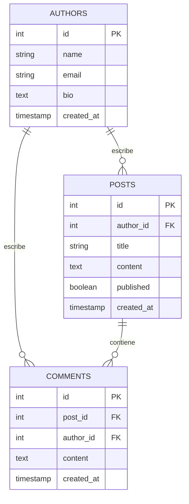

# MiniBlog

MiniBlog es un proyecto backend desarrollado con Node.js, Express y PostgreSQL para gestionar autores, posts y comentarios mediante una API REST.

## ✨ Sobre el proyecto

Este proyecto forma parte del trabajo integrador del módulo 2 de SoyHenry. Está pensado como una API básica, organizada y funcional, con pruebas automatizadas y documentación interactiva.

## 🚀 Funcionalidades

- CRUD de autores, posts y comentarios
- Validaciones básicas de entrada
- Respuestas HTTP consistentes
- Tests automatizados con Jest y Supertest
- Documentación OpenAPI/Swagger
- Despliegue en Railway

## 📁 Estructura del repositorio

```text
MiniBlog/
├── README.md
├── package.json
├── server.js
├── Desarrollo/
│   ├── app.js
│   ├── package.json
│   ├── .env.example
│   ├── src/
│   ├── db/
│   ├── sql/
│   ├── tests/
│   └── openAPI/
├── Documentación/
│   ├── README.md
│   └── doc AI/
└── .gitignore
```

- **Desarrollo/**: código principal del backend
- **Documentación/**: contexto general del proyecto y despliegue
- **[Documentación/doc AI](./Documentación/doc%20AI)**: notas y documentación generada con IA
- **server.js**: punto de entrada desde la raíz

## 🛠️ Tecnologías

Node.js · Express · PostgreSQL · Jest · Supertest · Swagger/OpenAPI

## ▶️ Inicio rápido

```bash
npm install
npm start
```

Para la guía técnica completa, ver [Desarrollo/README.md](./Desarrollo/README.md).

## 🧩 Diagrama de relaciones



## 🌐 Documentación desplegada

https://proyectom2caceresdiego-production-74e9.up.railway.app/api-docs/

## ✨ Autor

Diego Cáceres
Proyecto integrador del Módulo 2 – SoyHenry